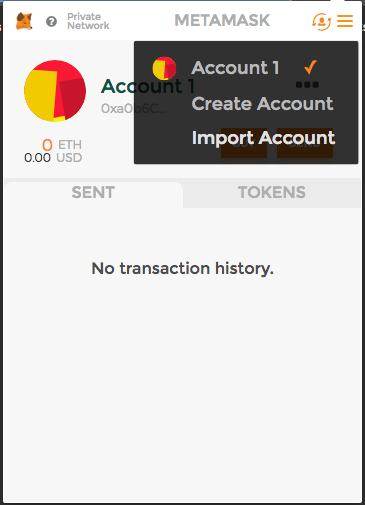
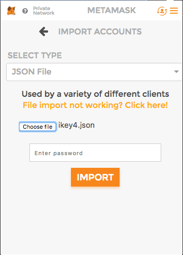

## Connect to Oracles network via MetaMask

### Install MetaMask plugin for Google Chrome
Install the MetaMask plugin from [Google Chrome Store](https://chrome.google.com/webstore/detail/metamask/nkbihfbeogaeaoehlefnkodbefgpgknn)

_Note that this plugin is currently available only for Google Chrome v59.0.3071.115 or later._

### Connect to the Oralces Network
1. Click on the Network name next to the head of the fox in the upper left corner and select "Custom RPC" from the dropdown list

RPC URL: `http://testnet.oracles.org:8545`
2. Enter the RPC connection url (it should have been provided to you by the master of the ceremony).

Note: _url on the screenshot below is just an example, use the one provided to you_

3. Wait a little bit, the network name in the left upper corner should change to "Private Network" 
### Importing of keys
1. Click on the account icon in the right upper corner, and then on "Import account"

2. In "Select Type" dropdown choose "JSON file" option. Then click on "Select file" and browse your filesystem to locate the keyfile. Enter password for the keyfile and click "Import".

Note: _name of the file on the screenshot below is just an example, it will different in your case_

