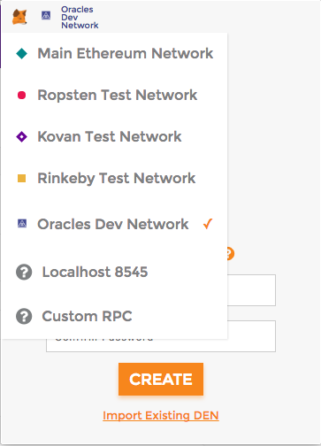

# Oracles network wiki

## Dapps setup

1. Get [Google Chrome plugin](https://chrome.google.com/webstore/detail/metamask/nkbihfbeogaeaoehlefnkodbefgpgknn) or [Mozilla Firefox Addon](https://addons.mozilla.org/en-US/firefox/addon/ether-metamask/) of MetaMask client.

2. Choose Oralces Dev Network from the list in MetaMask.

## Current members

To check, who are already have authority in Oracles network, go to [Validators Dapp](https://oraclesorg.github.io/oracles-dapps-validators/).

## Join the network

Joining to the Oracles network is managing by [Governance Dapp](https://oraclesorg.github.io/oracles-dapps-voting/).

## Ceremony

If you have an invitation from Oracles network, you'll be able to generate your production keys through [Ceremony Dapp](https://oraclesorg.github.io/oracles-dapps-keys-generation/) 

1. Import your initial key to MetaMask: browse keystore file, received from invitation, and enter password for the key.

2. Open Ceremony Dapp page and follow dapp's instructions. You'll get your production keys (mining, payout, voting) at the end of process.

3. Download keystore files of the generated keys and save paswords for the keys in a safe place.

## Mining node creation

If you are successfully generated production keys in previous step, you may create mining node from [template](https://github.com/oraclesorg/test-templates), using generated mining key.

## Governance

1. Import your payout and voting keys to MetaMask: browse keystore files and enter passwords for the keys

     a) received from [Ceremony Dapp](https://oraclesorg.github.io/oracles-dapps-keys-generation/) , if you are invited person
     
     b) or your own keys, if you were previously added to Oracles network by members by means of [Governance](https://oraclesorg.github.io/oracles-dapps-voting/) process.

2. If your production keys were generated by Oracles network (a) case), you need to transfer some coins from payout key to voting key to have ability of Governance Dapp usage.
Choose payout key in MetaMask and transfer some coins to voting key.

3. Choose voting key in MetaMask.

4. Open [Governance Dapp](https://oraclesorg.github.io/oracles-dapps-voting/) page. You'll be able to create ballots for adding or removing notaries and vote for them.
