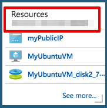
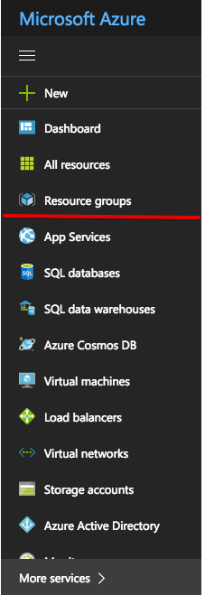
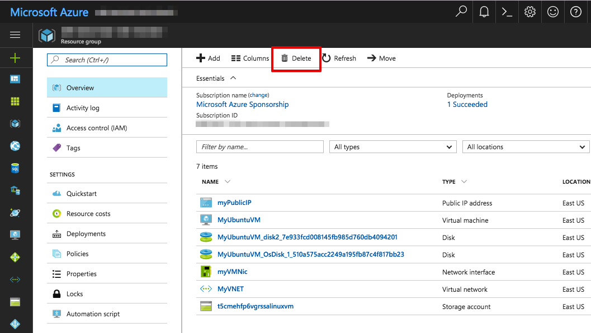
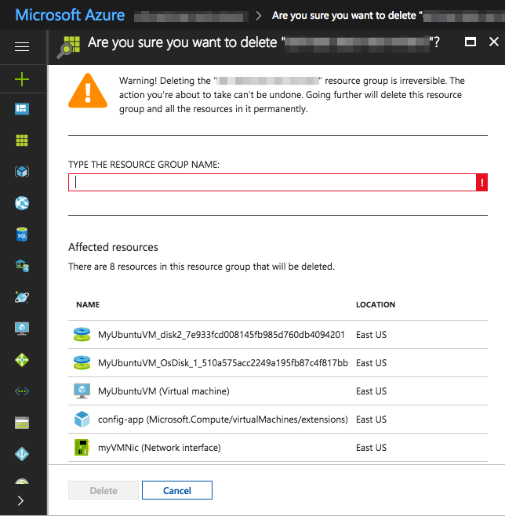
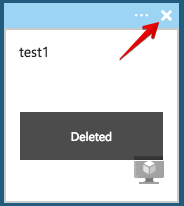

## How to delete existing mining node
0. Make sure you have your mining key address, keyfile and password obtained during keys generation process are saved somewhere.
If you create mining node again later, you will need them again.

1. open [Azure dashboard](https://portal.azure.com) and click on name of the resource group you created for the mining node

**if you don't see a box like this**, it is possible that you forgot to check "Pin to dashboard" checkbox during installation.
In this case, click "Resource groups" on the left sidebar. A list of all your resource groups will be displayed, select the one you created for the mining node:

2. click on the delete button on the top

3. read carefully what it says, you will need to type full name of the resource group to make sure you're of sound and disposing mind, memory and understanding

4. wait until you get notification that the resource group was successfully deleted.

5. unpin resource group shortcut from Azure dashboard

