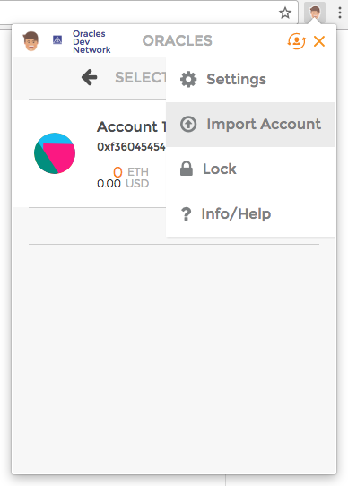
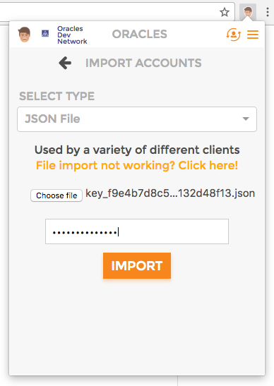

## Oracles plugin setup

### Supported browsers

* Google Chrome v 59.0.3071.115+

### Installing of Oracles plugin
Get [Google Chrome plugin](https://chrome.google.com/webstore/detail/oracles/jbdaocneiiinmjbjlgalhcelgbejmnid) of Oracles network.

### Choosing of Oralces Network

### Importing of keys

